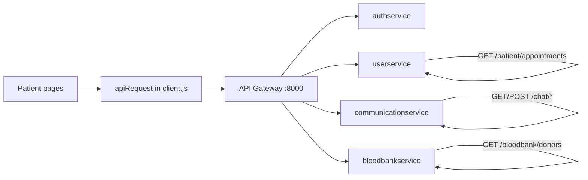
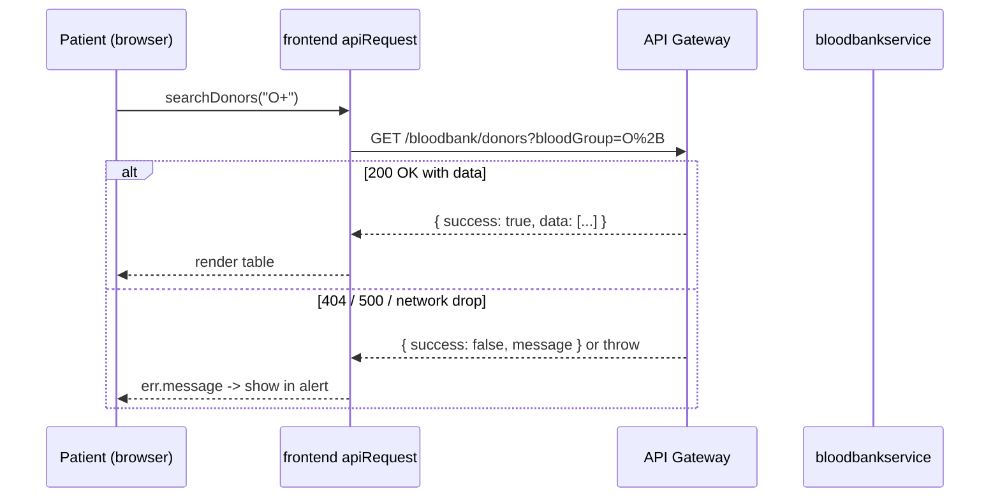
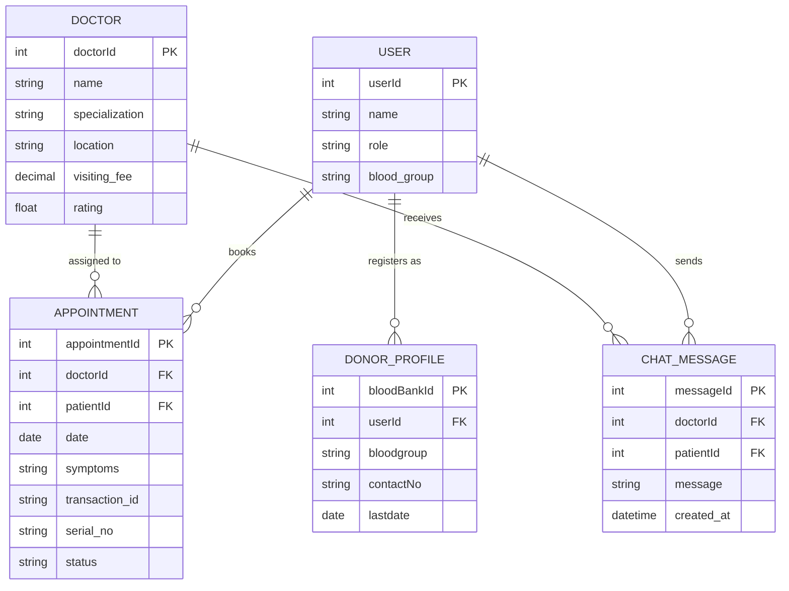

## Plan: Frontend polish sweep

**TL;DR**
The frontend has three real inconsistencies and one missing page. (1) `Blooddonor.jsx` swallows the real error inside `.catch` and only prints the generic "Network error…" string, so a 404 / 500 from the bloodbank service looks identical to a dropped connection. (2) `Chat.jsx` does fetch the history correctly, but the polling effect resets `chatStarted` to false on doctor-switch, the bubbles are not visually mine vs theirs reliably, and on reload the chat appears empty until "Open Chat" is clicked again. (3) There is **no appointments list page at all** — `BookAppointment` posts to `/patient/appointments` but no route reads `GET /patient/appointments`, and `App.jsx` does not register `/patient/appointments`. (4) Minor: the "Network error…" string is hard-coded in five places; centralising it will fix the next regression.

**Steps**
1. **Centralise the network-error message** — add a small `getErrorMessage(err, fallback)` helper in `api/client.js` (or a new `api/errors.js`) that returns `err.payload?.message || err.message || "Network error. Please try again."`, and use it in `Blooddonor.jsx`, `Chat.jsx`, `BookAppointment.jsx`, `DoctorDirectory.jsx`, and `Prescriptions.jsx` so the real backend reason reaches the user. (parallel with 2 and 3)
2. **Fix Blood Donor search error visibility** — in `Blooddonor.jsx`, replace the bare `catch { setSearchError("Network error. Please try again.") }` with `catch (err) { setSearchError(getErrorMessage(err)) }`, surface a Retry button next to the alert, and reset `searchedOnce` to `false` when the user changes the dropdown so the empty-state copy doesn't lie. (parallel with 1 and 3)
3. **Persist chat history across reloads and switches** — in `Chat.jsx`: (a) call `loadMessages()` directly when a doctor is picked from the `<select>` so the user sees prior messages without clicking "Open Chat"; (b) keep `chatStarted` true as long as `selectedDoctorId` is set and `messages` is loaded; (c) deduplicate polled messages by `messageId` instead of overwriting; (d) keep the scroll-to-bottom and send flow as-is. This makes the conversation visible to the patient as you described.
4. **Add an "My Appointments" page** — create `frontend/src/pages/patient/MyAppointments.jsx` that calls `GET /patient/appointments` (new endpoint helper `ENDPOINTS.appointments` is already there; verify the backend actually returns a list, otherwise reuse the same response shape from `POST /patient/appointments`). Render doctor, date, serial, status in a `mc-table` (reuse the pattern from `DoctorDirectory.jsx` / `Blooddonor.jsx`). Register the route in `App.jsx` as `/patient/appointments` and add a card to `PatientDashboard.jsx` `CARDS` array. Loading + error states must use the new helper from step 1.
5. **Wire the new appointments page from Navbar/PatientDashboard** — add a link in `PatientDashboard.jsx` `CARDS` for "My Appointments" so the user can reach it; keep the existing "Book Appointment" card next to it.
6. **Verify routing + smoke test** — run `npm run dev` in `frontend/`, log in as a patient, exercise: blood-donor search (with an empty result, a 404, and a 200), chat (send a message, refresh, see it), and appointments (book one, then see it on the new list page). Capture a screenshot of each.

**Relevant files**
- `frontend/src/api/client.js` — add `getErrorMessage` helper; currently it throws `new Error(message)` already, so pages just need to read `err.message`.
- `frontend/src/api/endpoints.js` — verify `appointments` is a `GET` endpoint too (currently only used as POST); add `appointmentsByPatient` if backend differentiates.
- `frontend/src/pages/patient/Blooddonor.jsx` — fix error catch, add retry, reset state on dropdown change.
- `frontend/src/pages/patient/Chat.jsx` — auto-load on doctor pick, dedupe polled messages, keep history.
- `frontend/src/pages/patient/BookAppointment.jsx` — same error-helper cleanup.
- `frontend/src/pages/patient/DoctorDirectory.jsx` — same error-helper cleanup; minor: add an empty-state for "no doctors match" when filters return zero.
- `frontend/src/pages/patient/PatientDashboard.jsx` — add "My Appointments" card to `CARDS`.
- `frontend/src/App.jsx` — register `/patient/appointments` route.
- `frontend/src/pages/patient/MyAppointments.jsx` — **new file** following the same shell as `Prescriptions.jsx` (Navbar + `mc-table-wrap`).
- `frontend/src/pages/patient/Prescriptions.jsx` (parallel, for the helper swap).

**Diagrams**

```mermaid
sequenceDiagram
  participant P as Patient
  participant C as Chat.jsx
  participant API as apiRequest
  participant CS as commservice

  P->>C: pick doctorId from <select>
  C->>API: GET /chat/messages?doctorId=..&patientId=..
  API->>CS: forward
  CS-->>API: { data: [...] }
  API-->>C: messages
  C-->>P: render chat-window
  loop every 5s while chat open
    C->>API: GET /chat/messages
    API-->>C: merge by messageId
  end
  P->>C: type + Send
  C->>API: POST /chat/send
  API-->>C: append msg
```

**Verification**
1. `cd frontend && npm run dev` boots cleanly with no new console errors.
2. As a patient: blood-donor search for an existing group shows a table; for a group with no donors the empty-state text appears; for a 4xx/5xx the alert shows the backend's `message` field (not the generic fallback).
3. As a patient: open Chat, pick a doctor, prior messages render automatically; send a message; refresh the page — the message is still there; switch to another doctor and back — the conversation is still there.
4. New `/patient/appointments` route loads, lists booked appointments in a table, shows an empty-state for a fresh user, and a "Book New Appointment" link points to `/patient/book`.
5. After booking from `BookAppointment.jsx`, the new appointment appears on the list without a manual reload (re-fetch on mount is enough for now).
